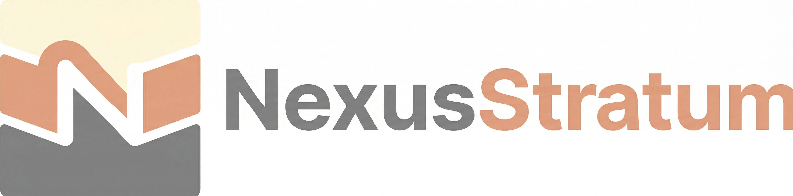

<p align="center">
  
</p>

<p align="center">
  <strong>A complete UI component system for Rust frontends.</strong>
</p>

<p align="center">
  <a href="https://github.com/AutomataNexus/NexusStratum#license"></a>
  <a href="https://www.rust-lang.org"></a>
  <a href="https://github.com/AutomataNexus/NexusStratum"></a>
</p>

---

## What is NexusStratum?

NexusStratum is a layered UI component architecture for Rust. It provides headless primitives, styled components, and framework adapters for building accessible, production-quality interfaces in **Leptos** and **Dioxus**.

The library is built in three independent layers:

- **Headless primitives** — Unstyled component logic with full ARIA compliance, keyboard navigation, and focus management. Zero styling opinions. Works with any Rust frontend framework.
- **Styled components** — Production-ready defaults built on Tailwind CSS. Override anything with a class prop.
- **Framework adapters** — Idiomatic APIs for Leptos (signals) and Dioxus (hooks). Same components, your framework's syntax.

On top of this: a design token system with 7 built-in themes, a CSS-in-Rust engine, 45+ embedded icons, animation utilities with reduced-motion support, and a security layer (XSS prevention, CSP, CSRF, SRI) built into every render path.

---

## Architecture

```
                       Your Application
               --------------------------------
              |                                |
      stratum-leptos                   stratum-dioxus
        (Leptos 0.8+)                   (Dioxus 0.6+)
              |                                |
               --------------------------------
                            |
                  stratum-components
                    (styled layer)
                            |
                  stratum-primitives
                   (headless layer)
                            |
                     stratum-core
                    (foundation)
                            |
        ----------------------------------------
       |          |            |         |      |
 stratum-    stratum-    stratum-  stratum-  stratum-
  theme       a11y        css     tailwind   icons
                                        |
                                  stratum-motion

  Tooling: stratum-cli | stratum-security | stratum-test
```

Every layer is independently usable. Use just the primitives for full control. Add the styled layer for speed. Add a framework adapter for idiomatic APIs. Or use all three.

---

## Quick Start

```toml
[dependencies]
stratum = { version = "0.1", features = ["leptos", "tailwind", "icons"] }
```

```rust
use stratum_leptos::*;

#[component]
fn App() -> impl IntoView {
    view! {
        <ThemeProvider theme=Theme::default()>
            <Button variant=ButtonVariant::Primary>
                "Get Started"
            </Button>
        </ThemeProvider>
    }
}
```

Components ship with sensible defaults, full keyboard support, and ARIA attributes out of the box.

---

## Components

50+ components across 8 categories. Each has a headless primitive and a styled variant.

| Category | Components |
|---|---|
| **Forms** | Button, Input, Textarea, Checkbox, Radio, Switch, Select, Combobox, Form, FormField, Slider, NumberInput, DatePicker |
| **Overlay** | Dialog, AlertDialog, Tooltip, Popover, Toast, Toaster, HoverCard, ContextMenu, Drawer, Sheet |
| **Navigation** | Tabs, Accordion, Menu, DropdownMenu, NavigationMenu, Breadcrumb, Pagination |
| **Data Display** | Card, Badge, Table, DataTable, Avatar, Tag, Progress, Skeleton, Spinner, Carousel, Timeline |
| **Layout** | Stack, HStack, VStack, Divider, Grid, Container, AspectRatio, ScrollArea, Resizable |
| **Typography** | Text, Heading, Link, Code, Kbd |
| **Feedback** | Alert, Banner, EmptyState, ErrorBoundary |
| **Utility** | Separator, VisuallyHidden, Portal, FocusScope |

---

## Framework Support

| Framework | Adapter | Status |
|---|---|---|
| Leptos 0.8+ | `stratum-leptos` | Supported |
| Dioxus 0.6+ | `stratum-dioxus` | Supported |

Components written against `stratum-primitives` are portable between frameworks.

---

## Theme System

Token-based theming with 7 built-in themes, light/dark mode, and custom palettes.

```rust
use stratum_theme::*;

// Built-in themes
let theme = Theme::default();    // clean neutral
let theme = Theme::rose();       // rose accent
let theme = Theme::blue();       // blue accent

// Custom theme
let custom = Theme::default()
    .with_primary(
        Hsl::new(262.0, 83.0, 58.0),  // light
        Hsl::new(262.0, 70.0, 68.0),  // dark
    )
    .with_font_sans("'Geist', sans-serif");

// Apply to your app
view! {
    <ThemeProvider theme=custom>
        <App />
    </ThemeProvider>
}
```

Themes cascade through context. Nested `ThemeProvider` enables scoped theme overrides.

---

## CLI

```bash
cargo install stratum-cli

stratum init --framework leptos     # set up project
stratum add button input dialog     # add components
stratum add --all                   # add everything
stratum list                        # show available components
stratum theme list                  # show built-in themes
```

`stratum add` copies component source into your project — you own the code.

---

## Security

Security is built into the framework, not bolted on:

- **XSS prevention** — All text escaping enforced by `RenderOutput::with_class` and `with_style`
- **CSP nonces** — `CspNonce` for Content-Security-Policy compliant style injection
- **CSRF tokens** — Constant-time validation with CSPRNG generation
- **SRI hashes** — SHA-256 subresource integrity for external resources
- **Input sanitization** — Tag stripping, control char removal, length limits
- **Security headers** — SSR response headers (CSP, X-Frame-Options, Referrer-Policy)

---

## Contributing

1. **Primitive first** — Headless component in `crates/stratum-primitives/`. Must handle ARIA, keyboard, and focus with zero styling.
2. **Styled layer** — Wrapper in `crates/stratum-components/`. Apply design tokens, test light/dark.
3. **Framework adapters** — Expose in `stratum-leptos` and `stratum-dioxus`.
4. **Tests** — Unit tests + accessibility checks. All components must pass with zero violations.
5. **PR** — `cargo clippy -- -D warnings` and `cargo test --workspace` must pass.

---

## License

Licensed under either of

- Apache License, Version 2.0 ([LICENSE-APACHE](LICENSE-APACHE) or <http://www.apache.org/licenses/LICENSE-2.0>)
- MIT License ([LICENSE-MIT](LICENSE-MIT) or <http://opensource.org/licenses/MIT>)

at your option.

Copyright (c) Andrew Jewell Sr. — AutomataNexus LLC
